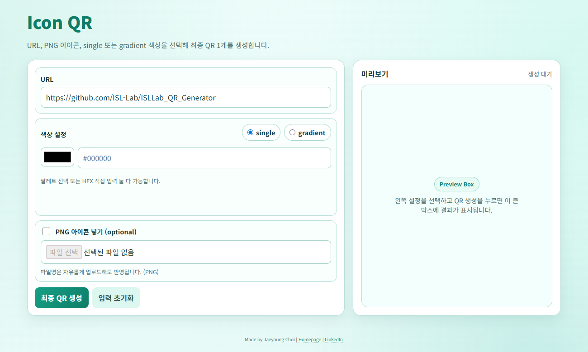
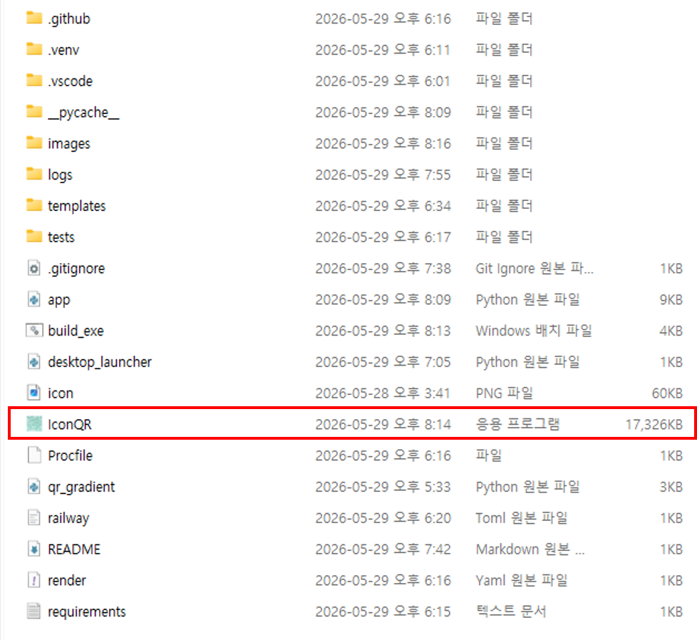

# Icon QR (Windows Local App)

## UI

*Main UI of the Icon QR application.*

## How to use
Then run: double-click `IconQR.exe`

Run `IconQR.exe`.

*Execute `IconQR.exe` to launch the app.*

## Note

Run `build_exe.bat` again only when the code changes.
